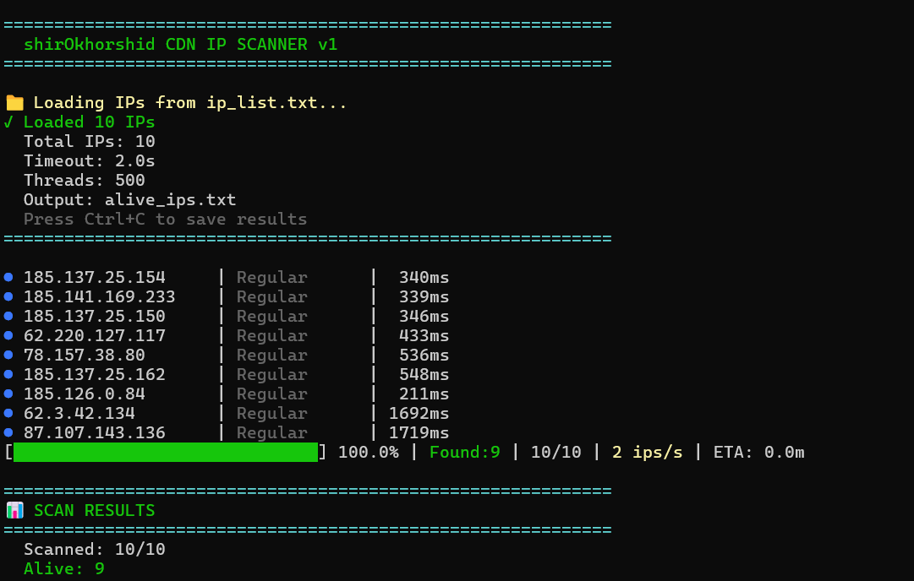

# 🦁 shirOkhorshid CDN IP Scanner v1

[](https://www.python.org/)
[](LICENSE)
[]()



---
**Scan thousands of IPs. Find CDN nodes. No limits.**

## What is shirOkhorshid?

A lightning-fast, pure Python IP scanner built for CDN detection. No ping dependencies. No subprocess headaches. Just raw speed.

- ⚡ 500+ concurrent connections (async I/O)
- 🎯 Detects Cloudflare, CloudFront, Akamai, Fastly
- 🖥️ Cross-platform: Windows, Linux, macOS
- ♾️ Zero artificial limits
- 🛑 Graceful Ctrl+C with auto-save

---

### 📦 Installation & Setup

**Step 1: Open CMD/Terminal in the scanner folder**

Windows:
- Open the scanner folder
- Type `cmd` in address bar, press Enter

Or:
- Shift + Right Click in folder
- Select "Open PowerShell/Command Prompt here"

Linux/macOS:
- Right click in folder
- Select "Open Terminal here"

**Step 2: Install requirements**

```bash
pip install -r requirements.txt
```
## 📝 Prepare IP List
### Open ip_list.txt and add your IPs. Supports these formats:
```bash
1.1.1.1                        # Single IP
8.8.8.8                        # Another single IP
192.168.1.0/24                 # CIDR range (254 IPs)
192.168.1.1-192.168.1.100      # Full range
10.0.0.1-254                   # Short range
104.16.124.96                  # Cloudflare IP
13.32.110.11                   # CloudFront IP
```

## 🚀 Usage

### Option 1: One-Click (Windows)
```bash
Double-click "scan.cmd"
It handles everything
```
### Option 2: Command Line
```bash
python cdn-scanner.py -i ip_list.txt
````
### Custom:
```bash
python cdn-scanner.py -i input.txt -o output.txt -t 2.0 -c 500
```
### See All Options
```bash
python cdn-scanner.py --help
```

---

### ❤️ Made with Love for Iranian Peoples

***For the freedom of information. For the right to access.***
